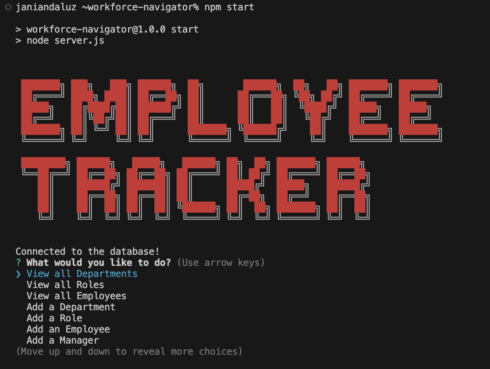
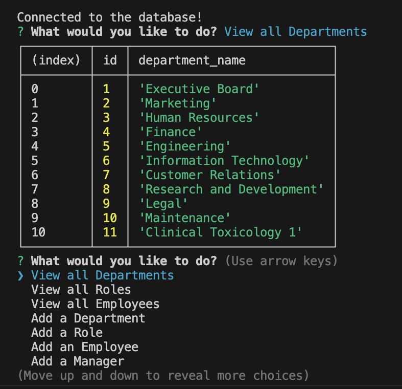
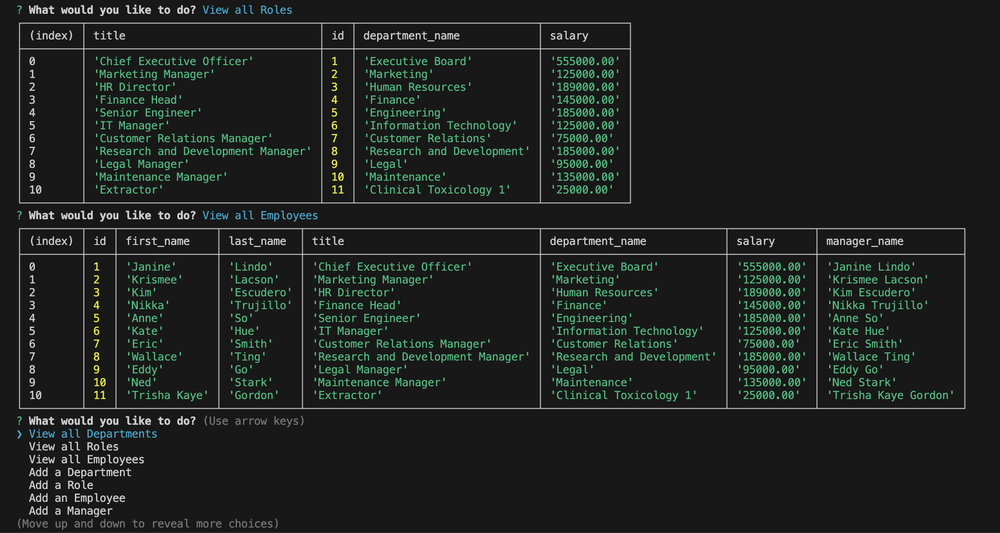
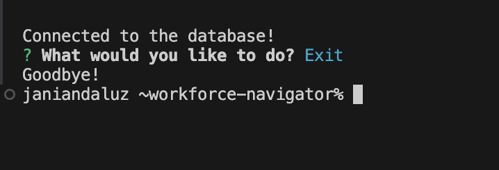

# Workforce Navigator

[](https://github.com/Thecaprifire)
[](https://choosealicense.com/licenses/mit/)
  
  
## Description:
Workforce Navigator is a command-line application designed to help business owners manage their company’s employee database. This tool allows users to view and manage departments, roles, and employees, facilitating better organization and planning within the business. Built with Node.js, Inquirer, and PostgreSQL, this application provides a seamless interface for non-developers to interact with the database.


 ## Table of Contents
  * [Description](#description)
  * [The Challenge](#the-challenge)
  * [User Story](#user-story)
  * [Acceptance Criteria](#acceptance-criteria)
  * [Installation Process](#installation-process)
  * [Walkthrough Video](#walkthrough-video)
  * [Screenshots](#screenshots)
  * [Resources](#resources)
  * [Questions](#questions)
  * [License](#license)


## The Challenge:
Develop a command-line application from scratch to manage a company's employee database, using Node.js, Inquirer, and PostgreSQL.


## User Story
```md
AS A business owner
I WANT to be able to view and manage the departments, roles, and employees in my company
SO THAT I can organize and plan my business
```


## Acceptance Criteria
```md
GIVEN a command-line application that accepts user input
WHEN I start the application
THEN I am presented with the following options: view all departments, view all roles, view all employees, add a department, add a role, add an employee, and update an employee role
WHEN I choose to view all departments
THEN I am presented with a formatted table showing department names and department ids
WHEN I choose to view all roles
THEN I am presented with the job title, role id, the department that role belongs to, and the salary for that role
WHEN I choose to view all employees
THEN I am presented with a formatted table showing employee data, including employee ids, first names, last names, job titles, departments, salaries, and managers that the employees report to
WHEN I choose to add a department
THEN I am prompted to enter the name of the department and that department is added to the database
WHEN I choose to add a role
THEN I am prompted to enter the name, salary, and department for the role and that role is added to the database
WHEN I choose to add an employee
THEN I am prompted to enter the employee’s first name, last name, role, and manager, and that employee is added to the database
WHEN I choose to update an employee role
THEN I am prompted to select an employee to update and their new role and this information is updated in the database
```


## Installation Process
1. Clone the repository: [Workforce Navigator](https://github.com/Thecaprifire/workforce-navigator)
2. Navigate to the project directory, and open it in any source code editor.
3. Install the following:
- Node.JS: [Version 20.14.0](https://nodejs.org/en/blog/release/v20.14.0/)
- Inquirer.js: [Version 8.2.4](https://www.npmjs.com/package/inquirer/v/8.2.4)
- cfonts: [Version 3.3.0](https://www.npmjs.com/package/cfonts)
- pg: [Version 8.12.0](https://www.npmjs.com/package/pg)
- dotenv: [Version 16.4.5](https://www.npmjs.com/package/dotenv)
4.	Set up the PostgreSQL database with the provided schema and seed data.
5.	Update the database configuration in the server.js file with your PostgreSQL credentials.
6. Open the integrated terminal for the document and complete the respective installation guides provided above in section (2.) to ensure the cloned documentation will operate.
7. Start the application with "npm start" and follow the on-screen prompts to view and manage your company’s departments, roles, and employees.

## Walkthrough Video:
[Click Here to Watch](https://youtu.be/Jxop6XtGTyo)


## Screenshots:
### Figure 1.
 
### Figure 2.

### Figure 3.

### Figure 3.



## Resources
- Dynamic JavaScript
- Node.JS [Version 20.14.0](https://nodejs.org/en/blog/release/v20.14.0/)
- Inquirer.js: [Version 8.2.4](https://www.npmjs.com/package/inquirer/v/8.2.4)
- cfonts: [Version 3.3.0](https://www.npmjs.com/package/cfonts)
- pg: [Version 8.12.0](https://www.npmjs.com/package/pg)
- dotenv: [Version 16.4.5](https://www.npmjs.com/package/dotenv)
  
## Questions
  Contact the author with any questions!<br>
  Github link: [Thecaprifire](https://github.com/Thecaprifire)<br>
  Email: ianjandaluz@gmail.com


## License
  This project is [MIT](https://choosealicense.com/licenses/mit/) licensed.<br />

  Copyright © 2024 [JAN IAN DALUZ](https://github.com/Thecaprifire)
  
  <hr>
  <p align='center'><i>
  Here’s to your coding journey! 🎉 JAN IAN DALUZ
  </i></p>